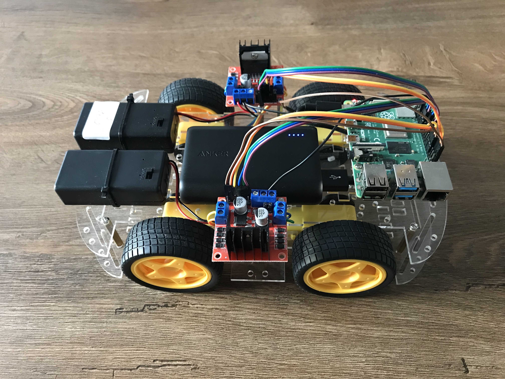
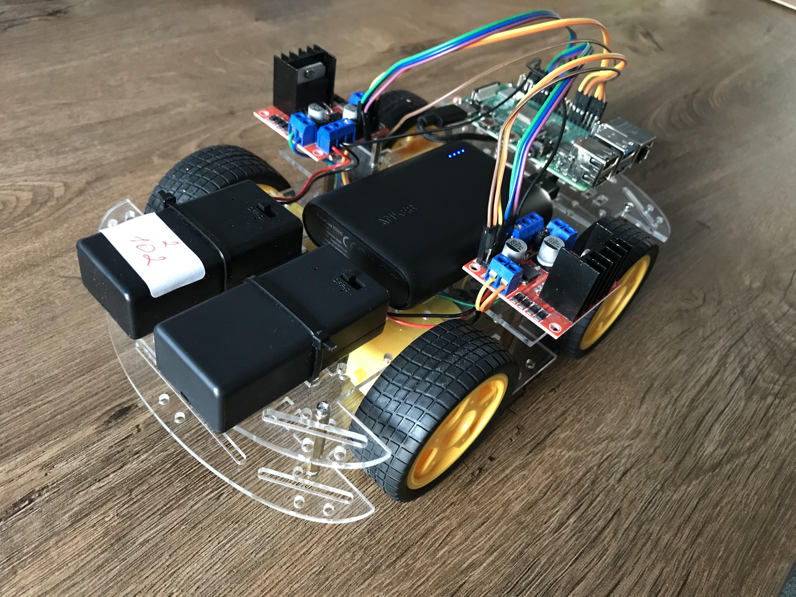
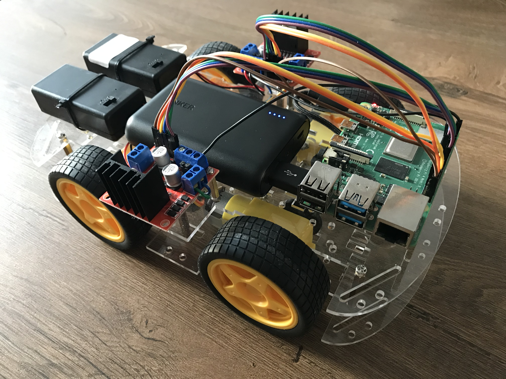

# VRM-Client
VRM-Client sends location signals and all the moves to VRM-Server and gets control-commands from the Server

The VRM-Client is written for Raspberry Pi 4.

A Client itself is a model car with 4 independent wheels based on Raspberry Pi. Each of the wheels is controlled by Motor Driver

The program works together with VRM-Server

Each Client has its own static IP address 

Usage: firstly VRM-Server should be started that awaits connections from clients

